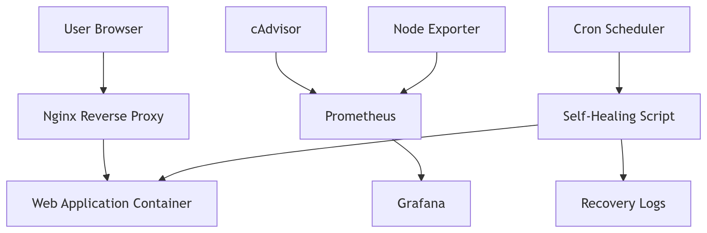
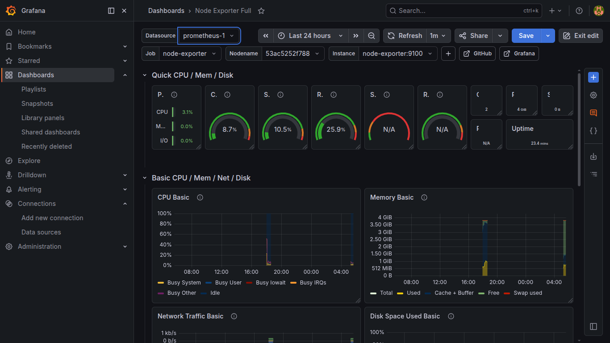
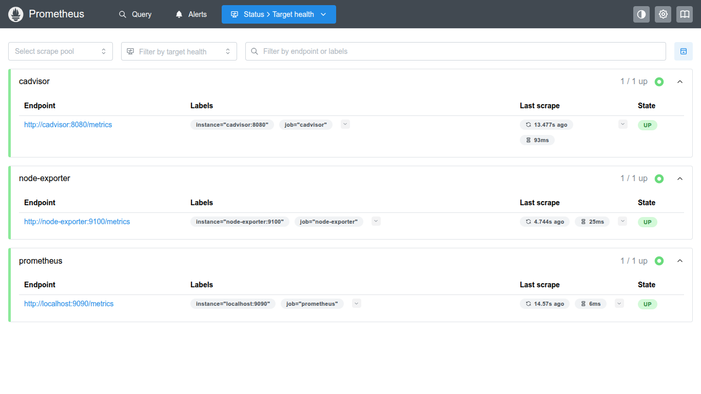
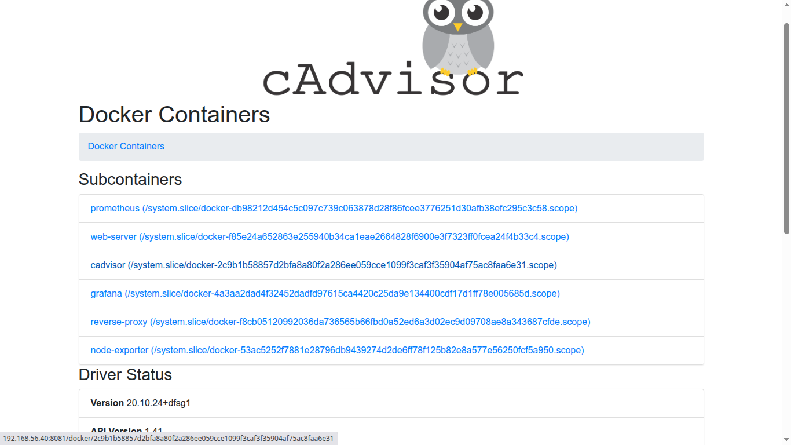
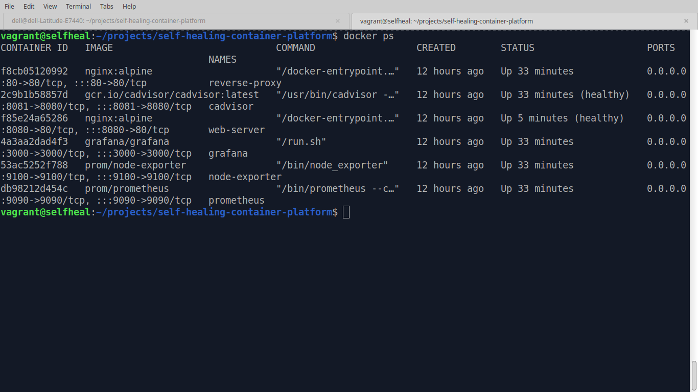
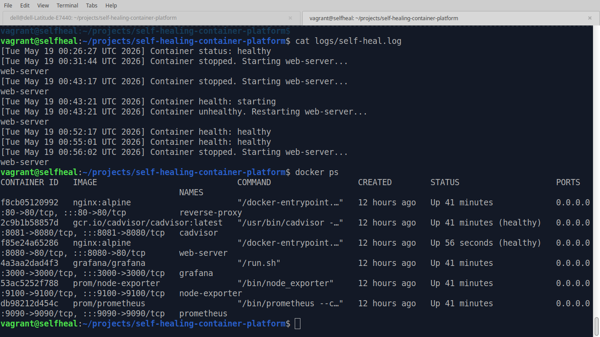

# 🚀 Self-Healing & Observability Container Platform

Production-style container platform with automated recovery, monitoring, observability, and self-healing infrastructure automation.


---

# 📌 Overview

This project demonstrates a production-style self-healing container infrastructure built using Docker Compose, Prometheus, Grafana, cAdvisor, and automated recovery scripting.

The platform continuously monitors container health, detects failures, logs incidents, and automatically restores unhealthy services using cron-based automation.

This project focuses on:

- Reliability Engineering
- Monitoring & Observability
- Automated Recovery
- Infrastructure Automation
- Container Health Management
- Incident Simulation
- DevOps & SRE Practices

---

# ⚙️ Technology Stack

| Technology | Purpose |
|---|---|
| Docker Compose | Multi-container orchestration |
| Nginx | Reverse proxy |
| Prometheus | Metrics collection |
| Grafana | Monitoring dashboards |
| cAdvisor | Container metrics |
| Node Exporter | System metrics |
| Bash | Recovery automation |
| Cron | Automated healing engine |
| Vagrant | Infrastructure virtualization |
| Debian 12 | Linux platform |

---
# 🏗️ Enterprise Architecture


```

---

# 🚀 Core Features

| Feature | Description |
|---|---|
| 🔄 Self-Healing | Automatic container recovery |
| 📊 Monitoring | Prometheus + Grafana stack |
| 📈 Observability | Live infrastructure metrics |
| 🖥️ Container Metrics | cAdvisor integration |
| 🧠 Auto Recovery Engine | Cron-based healing automation |
| 🚨 Alerting | Prometheus alert rule definitions |
| 📁 Recovery Logging | Incident & recovery logs |
| 🧪 Incident Simulation | Failure testing environment |
| 🌐 Reverse Proxy | Nginx frontend |
| 🐳 Docker Compose | Multi-service orchestration |

---

# 📂 Project Structure

```text
self-healing-container-platform/
├── app/
├── docs/
│   ├── architecture/
│   ├── screenshots/
│   └── troubleshooting/
├── logs/
├── monitoring/
├── nginx/
├── scripts/
├── docker-compose.yml
├── README.md
└── Vagrantfile
```

---

# 📸 Monitoring & Recovery Screenshots

## 📊 Grafana Dashboard



---

## 📈 Prometheus Targets



---

## 🖥️ cAdvisor Metrics



---

## 🐳 Docker Containers



---

## 🔄 Automated Self-Healing Logs



---
# 🔧 Self-Healing Implementation

The self-healing engine continuously monitors the critical application container and performs automated remediation when failures are detected.

### Detection Logic

The recovery script checks:

- Container running state
- Docker health check status
- Service availability
- Recovery event logging

### Recovery Actions

If a container is stopped:

- Docker automatically starts the service

If a container becomes unhealthy:

- Docker restarts the container
- Recovery events are logged
- Monitoring dashboards reflect service restoration

### Automation

A cron scheduler executes the recovery script every minute:

cron
* * * * * /vagrant/scripts/self-heal.sh

# 🚨 Monitoring & Alerting

Prometheus continuously collects infrastructure and container metrics from:

- Node Exporter
- cAdvisor
- Prometheus internal metrics

Alert rule definitions are maintained in:

```text
monitoring/alerts/container-alerts.yml
# 🔄 Self-Healing Workflow

```text
Container Failure
        ↓
Health Check Detection
        ↓
Cron Automation Trigger
        ↓
Recovery Script Execution
        ↓
Container Restart
        ↓
Recovery Logging
```

---

# 🧪 Incident Simulation

The platform supports:

- Container crash simulation
- Unhealthy container testing
- Automated recovery validation
- Recovery log auditing
- Monitoring visibility during failures
- Infrastructure resilience testing

---

# 🚀 Quick Start

## 1️⃣ Clone Repository

```bash
git clone https://github.com/muhammadkamrankabeer-oss/self-healing-container-platform.git
cd self-healing-container-platform
```

---

## 2️⃣ Start Virtual Infrastructure

```bash
vagrant up
```

---

## 3️⃣ Access VM

```bash
vagrant ssh
```

---

## 4️⃣ Start Platform

```bash
docker-compose up -d
```

---

# 🌐 Monitoring URLs

| Service | URL |
|---|---|
| Web App | http://192.168.56.40 |
| Grafana | http://192.168.56.40:3000 |
| Prometheus | http://192.168.56.40:9090 |
| cAdvisor | http://192.168.56.40:8081 |

---

# 🧠 Skills Demonstrated

- Docker & Docker Compose
- Monitoring & Observability
- Reliability Engineering
- Linux Administration
- Infrastructure Automation
- Incident Simulation
- Container Health Management
- Logging & Recovery Automation
- Infrastructure Virtualization
- SRE Concepts

---

# 🚀 Future Improvements

- Alertmanager integration
- Loki centralized logging
- Slack/Discord alerting
- Terraform infrastructure deployment
- Kubernetes migration
- CI/CD pipeline integration
- Automated backup system
- Multi-node container clustering

---
# 📚 Additional Documentation

- [Interview Guide](docs/interview-guide.md)
- [Architecture Source](docs/architecture/platform-flow.mmd)

# 👨‍💻 Author
---
Muhammad Kamran Kabeer

DevOps Engineer focused on Linux infrastructure, observability, automation, and Infrastructure as Code.

🌐 Website: https://www.devriston.com.pk

💼 LinkedIn: https://www.linkedin.com/in/kamrankabeer/

🐙 GitHub: https://github.com/muhammadkamrankabeer-oss

---

# ⭐ Support

If you found this project useful, consider giving it a star ⭐
